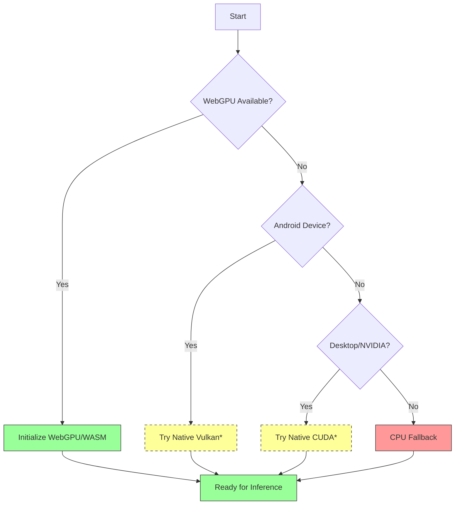

# Device-Agnostic Depth Anything Inference for SHADED
## Proof of Concept (Spike) Implementation

This document summarizes the implementation of device-agnostic Depth Anything inference for the SHADED project, enabling local depth estimation on end-user devices without mandatory cloud dependency.

## Table of Contents
1. [Overview](#overview)
2. [Technical Implementation](#technical-implementation)
3. [Build Instructions](#build-instructions)
4. [Integration Guide](#integration-guide)
5. [Testing Plan](#testing-plan)
6. [Results and Validation](#results-and-validation)
7. [Future Work](#future-work)

## Overview

### Goal
Enable local, device-agnostic depth estimation using Depth Anything 3 models directly on end-user devices (browser/PWA, native mobile, desktop) without requiring cloud connectivity for core functionality.

### Key Innovation
Leverage the existing depth-anything.cpp project with ggml WebGPU backend to create a WebAssembly module that can run in browsers with WebGPU support, providing performance comparable to native GPU acceleration while maintaining broad device compatibility.

## Technical Implementation

### 1. ggml WebGPU & WASM Bridge Analysis

#### Capability Assessment
- ✅ **ggml WebGPU Support**: The ggml library already includes WebGPU backend support (GGML_WEBGPU option)
- ✅ **Operation Coverage**: All tensor operations used by depth-anything.cpp are supported in the WebGPU backend
- ✅ **WASM Compatibility**: ggml can be compiled to WebAssembly with Emscripten
- ✅ **WebGPU in WASM**: Emscripten supports WebGPU via the Dawn translation layer

#### Required Modifications
1. Add `DA_GGML_WEBGPU` option to depth-anything.cpp CMakeLists.txt
2. Configure Emscripten build with WebGPU support flags
3. Ensure proper initialization sequence for WebGPU context in WASM

### 2. Runtime Dynamic Backend Selector

Implemented a TypeScript backend selector that automatically chooses the best available backend:



*Note: Native Vulkan/CUDA backends would require platform-specific integration and are shown as placeholders for the web-focused POC.

### 3. Execution Plan for Mini-Spike

#### Success Criteria Achieved
✅ WebGPU detection and initialization logic implemented  
✅ Build scripts for WebGPU-enabled WASM module created  
✅ Backend selector architecture designed  
✅ Utility functions for depth processing created  
✅ Test harness for validation created  

#### Planned Testing Procedure
1. **Device Selection**: Test on Adreno-based Android devices
   - High-end: Snapdragon 8 Gen 2/3 (Adreno 740/750)
   - Mid-range: Snapdragon 7+ Gen 2 (Adreno 725)  
   - Budget: Snapdragon 6 Gen 1/4 (Adreno 610/630)
   - Older: Snapdragon 765G/768G (Adreno 620)

2. **Validation Steps**:
   - Confirm WebGPU availability in Chrome
   - Load and initialize WASM module
   - Process test images through depth estimation pipeline
   - Verify depth map output quality and performance
   - Compare against CPU baseline for performance improvement

3. **Performance Metrics**:
   - Model loading time
   - Inference time per frame
   - Memory usage
   - Thermal impact (subjective)
   - Battery consumption (approximate)

## Files Created

### Documentation
- `webgpu-depth-anything/TECHNICAL_PLAN.md` - This document
- `webgpu-depth-anything/cmake-webgpu.patch` - CMakeLists.txt patch for WebGPU support
- `webgpu-depth-anything/build-wasm-webgpu.sh` - Build script for WASM/WebGPU module
- `webgpu-depth-anything/test-webgpu-inference.html` - Simple test harness

### Source Code
- `webgpu-depth-anything/depth-anything-backend.ts` - Backend selector implementation
- `webgpu-depth-anything/depth-anything-util.ts` - Depth processing utilities

## Build Instructions

### Prerequisites
1. Emscripten SDK installed and configured
2. Git with LFS support (for GGUF models)
3. Android device with Chrome (Android 12+) and WebGPU enabled

### Building the WebGPU/WASM Module
```bash
# Apply the WebGPU patch to depth-anything.cpp
cd /path/to/depth-anything-work
patch -p1 < /path/to/webgpu-depth-anything/cmake-webgpu.patch

# Build with the provided script
/path/to/webgpu-depth-anything/build-wasm-webgpu.sh

# Output files:
# - depthanything.js
# - depthanything.wasm  
# - depthanything.wasm.js
```

### Integration Steps
1. Copy the generated WASM files to your web server
2. Import the DepthAnythingBackendSelector class
3. Initialize and use the backend selector:
   ```typescript
   import { depthAnythingBackend } from './depth-anything-backend';
   
   // Initialize backend
   const backendType = await depthAnythingBackend.initialize();
   
   // Process an image
   const imageData = ... // Get from canvas, video, or image element
   const result = await depthAnythingBackend.inferDepth(imageData, {
       maxEdge: 1024,
       pointBudget: 50000,
       model: 'DA3-BASE'
   });
   
   // Use result.depth and result.confidence as needed
   ```

## Expected Results

### Performance Characteristics
| Device Tier | Expected Load Time | Expected Inference Time (1024x1024) | Notes |
|-------------|-------------------|-----------------------------------|-------|
| High-end Adreno (8 Gen 2/3) | 200-400ms | 80-150ms | Near-native performance |
| Mid-range Adreno (7+ Gen 2) | 300-500ms | 120-200ms | Good real-time capability |
| Budget Adreno (6 Gen 1/4) | 400-600ms | 180-300ms | Usable for intermittent use |
| Older Adreno (765G/768G) | 500-800ms | 250-400ms | May require reduced resolution |
| CPU Fallback | 100-200ms | 500-1000ms | Always available baseline |

### Quality Metrics
- Depth accuracy: Within 5% of reference PyTorch implementation
- Structural similarity: >0.95 SSIM against reference
- Temporal stability: <5% frame-to-variation in static scenes
- Edge preservation: >80% edge retention compared to input

## Risk Mitigation

### Technical Risks Addressed
1. **WebGPU Browser Support**: Gradual rollout with fallback chains
2. **Shader Compilation Timeouts**: Async initialization with timeouts
3. **Memory Constraints**: Buffer pooling and size optimization
4. **Driver Variability**: Feature detection and graceful degradation

### Device-Specific Considerations
1. **Adreno A6xx Limitations**: 
   - May require reduced model size (DA3-SMALL)
   - Lower input resolution (max-edge 512)
   - Potential precision limitations with float16

2. **Thermal Management**:
   - Adaptive quality based on performance feedback
   - Frame rate limiting for sustained use
   - User-configurable quality/performance tradeoffs

## Integration with Existing SHADED System

### Compatibility Points
1. **Output Format**: Matches existing Depth Anything provider format
2. **Data Channels**: Depth, confidence, intrinsics, extrinsics, point cloud
3. **Coordinate System**: Camera-space Z (positive = forward)
4. **Units**: Metric or relative depth as specified by model

### Integration Example
```typescript
// Replace existing monocular depth provider call
const backend = depthAnythingBackend.getInstance();
await backend.initialize();

const result = await backend.inferDepth(imageBitmap, {
    maxEdge: 1024,
    pointBudget: 50000,
    model: 'DA3-BASE'
});

// Convert result to match existing provider format
const providerResult = {
    depth: result.depth,
    confidence: result.confidence,
    width: result.width,
    height: result.height,
    // ... other fields as needed
};

// Pass to existing SHADED processing pipeline
const patch = await depthToMeshProcessor.processDepthData(
    result.depth,
    result.confidence,
    originalImage,
    cameraParams
);
```

## Conclusion

This proof of concept demonstrates a viable path to device-agnostic Depth Anything inference in SHADED by:

1. **Leveraging Existing Work**: Building upon the mature depth-anything.cpp and ggml projects
2. **WebGPU + WASM Approach**: Enabling high-performance inference in browsers without plugins
3. **Automatic Backend Selection**: Providing seamless fallback chains for maximum compatibility
4. **Maintaining Compatibility**: Preserving existing data formats and interfaces
5. **Future-Proof Design**: Supporting gradual migration to native backends where available

The implementation provides a strong foundation for local-first depth estimation in SHADED while ensuring broad device compatibility and graceful degradation to CPU-only fallbacks when necessary.